# KIFF

[](https://pkg.go.dev/github.com/kiff/kiff)
[](https://goreportcard.com/report/github.com/kiff/kiff)
[](./LICENSE)
[](./go.mod)
[](https://github.com/kiff/kiff/releases)

**Put agents on consequential actions without handing them unchecked side effects.**

Give a support agent the refund button. The eligible refund runs. A high-risk
refund waits for a human, then executes once approved. A repeat after the order
is already `REFUNDED` is refused before any money moves. Every step replays.

```text
agent proposes → KIFF reads state → action runs or waits → result is replayable
```

KIFF is a small Go framework for backends where agents do real work — refunds,
paid invoices, payouts, record changes. The agent proposes; KIFF validates the
action against the entity's event-derived state and your contract before your
executor runs.

## See it

A 24-second terminal tour — no install needed:



1. An order is placed and the agent marks it paid. The action executes.
2. The agent tries a `$999` refund without approval. KIFF holds it for a human.
3. A human grants approval. The same call now executes.
4. Replay rebuilds the entity from events alone. Every fact reconstructs.

Run it yourself:

```bash
git clone https://github.com/kiff/kiff
cd kiff
go run ./cmd/kiff-tour
```

## Try it

Scaffold a complete, runnable project and start the server:

```bash
go install github.com/kiff/kiff/cmd/kiff@latest
kiff new github.com/acme/orders
cd orders
go mod tidy
go run ./cmd/server
```

`kiff new` scaffolds a runnable HTTP server and a tiny `tasks` starter domain —
rename the entity, events, states, and actions to match yours. Want the full
governed-action example (an `Order` with `MARK_PAID` and an approval-gated
`REFUND_ORDER`, a headless agent API, and a `make demo` walkthrough)? Scaffold
the refund scenario:

```bash
kiff new -scenario refund github.com/acme/refunds
```

While the framework is unpublished, scaffold against a local checkout with
`kiff new -replace-local /path/to/kiff github.com/acme/orders`.

Two more CLI paths: `kiff scaffold` generates a `domain/` package from a JSON
descriptor, and `kiff verify` checks a domain is complete — no stub executors,
a consistent state machine, complete contracts — before it ships. See
[scaffold from a descriptor](./docs/scaffold-a-domain.md).

## What the refund scenario gives you

The `-scenario refund` project above is wired with:

- a typed action contract per risky action (allowed states, params, permissions, risk, approval)
- a headless HTTP API for agent tools, plus the KIFF governance API
- persistence options for the action + evidence trail (`file`, `postgres`, or `memory`)
- deterministic state/duplicate handling — the repeat is refused, not double-executed
- replayable decision evidence: rebuild the entity from events alone
- positive and adversarial tests around the risky path

An external caller does not need Go. A proposal is a single HTTP POST, so an
agent, webhook, or backend in any language drives the same runtime — see
[governing over HTTP](./docs/governing-over-http.md) for copy-paste TypeScript
and Python.

## How it works

The agent proposes an action. KIFF validates it against the entity's
event-derived current state, the required parameters, the actor's permissions,
and the approval requirement. Only an allowed action reaches your executor;
everything else returns a typed reason (`approval_required`, `permission_denied`,
`state_not_allowed`, `missing_parameter`, `blocked`) and leaves production
untouched. Callers cannot self-grant approval — that boundary is enforced at
compile time.

Read the full model in [the governed action boundary](./docs/governed-action-boundary.md).

A domain is a small Go definition — a state machine plus action contracts:

```go
def, _ := domain.New("refund").
    Entity("Order").
    Transition("ORDER_PAID", "CREATED", "PAID").
    Transition("ORDER_REFUNDED", "PAID", "REFUNDED").
    Allow("PAID", "REFUND_ORDER").
    Action(RefundOrderContract()). // high-risk, approval required
    Build()

rt, _ := runtime.NewForDomain(def, runtime.Config{PermissionPolicy: refund.NewPermissionPolicy()})
```

Each contract declares its allowed states, required parameters and permissions,
risk, approval requirement, and executor. The shortest worked example is
[examples/refund](./examples/refund/); [build a domain](./docs/build-a-domain.md)
is the full walkthrough.

## Where to go next

- [Build a domain](./docs/build-a-domain.md) — the authoring guide, end to end.
- [Scaffold from a descriptor](./docs/scaffold-a-domain.md) — generate a domain from JSON.
- [The governed action boundary](./docs/governed-action-boundary.md) — how decisions and approvals work.
- [Govern over HTTP](./docs/governing-over-http.md) — connect a non-Go agent or backend.
- [Connect an existing agent](https://github.com/kiff/kiff-guard) — `kiff-guard` adapters for Agno, LangGraph, OpenAI Agents, and more.
- [Architecture & packages](./docs/architecture.md) — the package map and responsibilities.
- [Why KIFF](./docs/why.md) · [Philosophy](./docs/philosophy.md) · [Comparisons](./docs/comparisons.md) — positioning and honest limits.

## Who it is not for

If your app is simple CRUD, or direct LLM tool calls with no consequential
state, KIFF is too much structure — ship something smaller. KIFF earns its keep
when multiple actors touch the same state, what is allowed depends on lifecycle,
some actions need a human sign-off, and someone eventually asks "why did this
happen?" See [comparisons](./docs/comparisons.md) for where KIFF stops and a
workflow engine or model SDK takes over.

## Status

KIFF is at v0.6. The core action boundary is complete and tested: approvals
cannot be self-granted, executors must be explicit, and every validation and
execution is recorded. For production, implement the store interfaces against a
real backend — the [Postgres store](./pkg/kiff/store/postgres) is the reference;
the file-backed JSONL stores are for demos and local development.

## License

MIT. Use it. Fork it. Ship with it.
