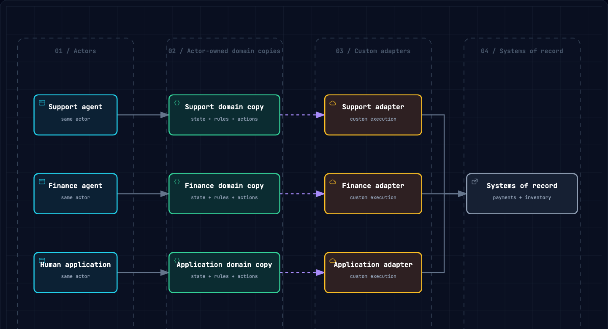
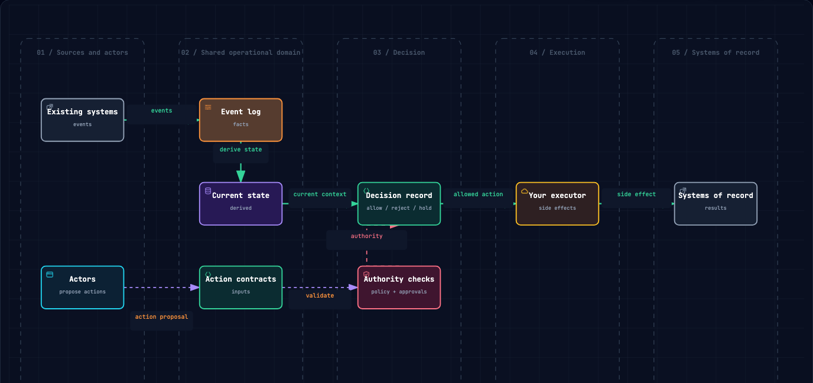

<p align="center">
  
</p>

<h1 align="center">KIFF</h1>

<p align="center"><strong>Your agents can have different memories. They cannot have different realities.</strong></p>

<p align="center">
  <a href="https://github.com/kiff/kiff/actions/workflows/ci.yml"></a>
  <a href="https://pkg.go.dev/github.com/kiff/kiff"></a>
  <a href="./LICENSE"></a>
  <a href="./go.mod"></a>
  <a href="https://github.com/kiff/kiff/releases"></a>
</p>

KIFF is the reality layer for agentic systems. It gives every agent, human, and
service the same answer to what happened, what is true now, what can happen
next, and who may make it happen.

In KIFF, that executable model is an **operational domain**. Events establish
state. State determines which named actions are valid. Permissions and
approvals determine who has authority. Execution results return to the same
history, so the operation can be explained and replayed.

KIFF does not replace your databases or systems of record. It turns their
events into shared operational state and governs actions back into them. The
open-source Go framework provides the domain model, runtime, stores, HTTP API,
and CLI needed to run that layer yourself.

## From Memory to Reality

Memory belongs to an agent. It can be private, incomplete, or different from
one agent to the next. Operational reality belongs to the system. Every actor
must be able to answer the same questions:

| Question every actor must answer | KIFF's answer |
| --- | --- |
| What happened? | Recorded events and execution outcomes |
| What is true now? | State derived from those events |
| What can happen next? | Named actions and valid transitions |
| Who may do it? | Permissions, risk policies, and approvals |
| Why did it happen? | One decision and audit history |

## When Every Agent Builds Its Own Reality

The first agent is usually a feature. The next few need a system.

When three actors join the same process, the common pattern is three backend
copies. Each owns an interpretation of state, rules, actions, and a custom path
into the same systems. That works in isolation. Together, those copies drift,
disagree, and multiply the coordination work.



## One Reality, Many Actors

The actors and systems do not change. KIFF replaces the repeated domain copies
with one operational domain and one validated execution path. Every actor sees
the same state, proposes the same named actions, and meets the same authority
and approval rules.

This does not replace your agent framework, HTTP stack, queue, cron job, or
systems of record. It gives them a shared reality and evaluates proposed
actions against current state before your executor runs.



| Without a reality layer | With KIFF | Practical effect |
| --- | --- | --- |
| Each actor carries its own version of state and rules. | Events and derived state are shared. | Actors stop disagreeing about what is true. |
| Every new actor builds another operational backend. | Actors propose the same named actions. | Add agents without rebuilding the operation. |
| Decisions live in application code, prompts, and tool handlers. | One authority boundary evaluates every proposal. | Consistent approvals and refusals. |
| Logs are scattered across services. | Events, decisions, and results form one history. | Replay and explain an operational outcome. |

## A Concrete Example

One operational reality, one refund:

```text
order-2 is PAID

  agent → REFUND_ORDER  $999, high-risk
  KIFF  ⏸ HELD — approval required            the executor did NOT run
  human → approves
  KIFF  ✓ ALLOWED — refund executes → REFUNDED

  agent → REFUND_ORDER  (same call, retried)
  KIFF  ✗ BLOCKED — order is already REFUNDED  refused before money moves again

  replay from events alone → REFUNDED          materialized == replayed
```

The useful action runs. The risky one waits for a human. The duplicate is
refused. The path rebuilds from the event log.

Run the live tour:

```bash
go run ./cmd/kiff-tour
```

## Try It

```bash
go install github.com/kiff/kiff/cmd/kiff@latest
kiff new -scenario refund github.com/acme/refunds
cd refunds
go mod tidy
make demo
```

That creates a runnable refund domain with an `Order`, a `MARK_PAID` action, an
approval-gated `REFUND_ORDER` action, a headless HTTP API, and a demo script.
Use `kiff new <module>` without `-scenario` for a smaller starter project.

## One CLI, End to End

The `kiff` CLI stays with the project from the first domain to a running
system:

| Workflow | What it gives you | Commands |
| --- | --- | --- |
| Start | A runnable KIFF project, with an optional working scenario | `kiff new` |
| Generate | A typed Go domain from a JSON descriptor | `kiff scaffold` |
| Validate | Structural domain checks and static analysis for unguarded Go tools | `kiff verify`, `kiff scan` |
| Investigate | A readable action, approval, and outcome history for one entity | `kiff timeline` |
| Publish | Authentication and domain contract deployment to KIFF Cloud | `kiff auth`, `kiff apply` |
| Operate | Views of domains, runtimes, governed usage, and active API keys | `kiff domains`, `kiff runtimes`, `kiff usage`, `kiff keys` |

Run `kiff help` for the full command list or `kiff <command> -h` for flags.

## Connect an Agent

If you already have an agent, you can bring its tool calls into the same
operational reality without restructuring it. The guard SDK connects KIFF to
the pre-execution seam your framework already exposes:

```bash
pip install kiff-guard          # or: npm install @kiff/kiff-guard
```

```python
from kiff_guard import Guard
from kiff_guard.adapters.agno import agno_hook

guard = Guard(mode="observe")   # observe records; enforce refuses before the call runs
agent = Agent(model=..., tools=[refund_order], tool_hooks=[agno_hook(guard)])
```

### Supported agent frameworks

KIFF Guard ships 11 framework adapters across Python and TypeScript:

| | | |
|:---:|:---:|:---:|
| **Agno**<br><sub>Python adapter</sub> | **LangGraph / LangChain**<br><sub>Python adapter</sub> | **OpenAI Agents SDK**<br><sub>Python adapter</sub> |
| **Google ADK**<br><sub>Python adapter</sub> | **Pydantic AI**<br><sub>Python adapter</sub> | **Strands Agents**<br><sub>Python adapter</sub> |
| **Microsoft Agent Framework**<br><sub>Python adapter</sub> | **Hermes**<br><sub>Python adapter</sub> | **Haystack Agents**<br><sub>Python adapter</sub> |
| **LlamaIndex**<br><sub>Python adapter</sub> | **OpenClaw**<br><sub>TypeScript adapter</sub> | **Custom / no framework**<br><sub>No adapter required</sub> |

The adapters are thin integrations at each framework's pre-tool-call boundary;
KIFF's decision logic stays in the shared guard core. A custom stack can call
that core directly or use plain HTTP without an adapter. See the
[SDK quickstarts and adapter docs](https://github.com/kiff/kiff-guard#readme)
(MIT).

## Run It Yourself or Hosted

The framework and guard SDK are MIT. Self-host your operational domain with the
`postgres` store and your own HTTP stack for as long as you like.

If you would rather not operate the state, approvals, receipts, and retention
yourself, [KIFF Cloud](https://kiff.dev) runs them as a hosted control plane
with a free tier. The CLI talks to it directly: `kiff auth login`, then
`kiff apply` to push a domain contract, and `kiff domains`, `kiff runtimes`,
`kiff usage`, `kiff keys` to inspect a tenant. Nothing in this repository
requires it.

## Executable Reality

| Capability | What KIFF provides |
| --- | --- |
| Shared state | Events, state transitions, replay, and `memory`, `file`, or `postgres` stores |
| Named actions | Typed parameters, allowed states, required permissions, risk, and explicit executors |
| Human authority | Dynamic approvals, reviewer permissions, and segregation-of-duties checks |
| Reliable execution | Validation before side effects and idempotency protection for consequential retries |
| Explainable history | Proposals, decisions, approvals, execution results, and failures as protocol data |
| Open interfaces | An optional `net/http` API and CLI for agents, services, operators, and CI |

## Check the Agent Boundary

Use `kiff scan .` inside a Go agent repository to find explicit agent tools
that can reach consequential operations without a recognized decision earlier
in the function. Mark a handler with `//kiff:tool`, pass it to a common tool
registration call, or identify it with `-tool FunctionName`. The initial Go
scanner emits terminal, JSON, and SARIF reports and can enforce a CI threshold:

```bash
kiff scan .
kiff scan -format sarif -output kiff-scan.sarif -fail-on high .
```

This is static analysis: a clean result means no supported path was found, not
that the application is safe or that every framework-specific registration
shape is understood.

For Python agent repositories, use the separate
[kiff-scan](https://github.com/kiff/kiff-scan) tool instead:

```bash
uvx kiff-scan scan .
```

It also ships a GitHub Action: `uses: kiff/kiff-scan@v0.1.1`.

### Coding Assistant Integrations

These integrations help developers run KIFF's scanners, understand findings,
and fix the code. They are development tools, not runtime agent adapters.

| | | |
|:---:|:---:|:---:|
| **[Codex](./docs/assistant-integrations.md#codex)**<br><sub>Agent Skill</sub> | **[Claude Code](./docs/assistant-integrations.md#claude-code)**<br><sub>Plugin / skill</sub> | **[Kiro](./docs/assistant-integrations.md#kiro)**<br><sub>Power / Agent Plugin</sub> |

All three ship the same two skills. See the
[installation guide](./docs/assistant-integrations.md) for setup and example
prompts.

- **`kiff-governance`** — run the scanners, explain findings, and route
  consequential actions through a real decision boundary. Development workflow.
- **`kiff-audit`** — an adversarial governance audit: extract the guarantees a
  codebase claims, map its trust boundary, construct and execute attacks against
  those guarantees, run the language's test and vulnerability tooling, and
  produce an evidence-backed report with P0/P1 findings and a verdict.

`kiff-audit` is deliberately not a linter. It treats a claimed guarantee as false
until an attack against it has failed, and it reports what it could not establish
as `not assessable` rather than as a pass. The
[reference audit](./skills/kiff-audit/examples/kiff-framework-audit.md) is a real
engagement against this repository in which three of four attacks on the
self-approval boundary succeeded.

## Documentation

- [Why KIFF](./docs/why.md) — why multiple actors need the same operational reality
- [The governed action boundary](./docs/governed-action-boundary.md) — how decisions, approvals, and replay work
- [The side-effect boundary](./docs/side-effect-boundary.md) — deployment topology: agents propose, executors own credentials
- [Cookbook guide](./docs/cookbook-guide.md) — choose, evaluate, and adapt a governed agent recipe
- [Build a domain](./docs/build-a-domain.md) — the authoring guide, end to end
- [Scaffold from a descriptor](./docs/scaffold-a-domain.md) — generate a domain from JSON
- [Govern over HTTP](./docs/governing-over-http.md) — drive KIFF from TypeScript, Python, or any stack
- [Coding assistant integrations](./docs/assistant-integrations.md) — install and use the Codex, Claude Code, and Kiro skill
- [Architecture & packages](./docs/architecture.md) — the package map and responsibilities
- [Philosophy](./docs/philosophy.md) and [Comparisons](./docs/comparisons.md) — what KIFF is, and where it stops

## Examples

- [examples/refund](./examples/refund/) — one entity, three states, two actions
- [examples/mission](./examples/mission/) — a larger stateful coordination domain
- [examples/llm-bridge](./examples/llm-bridge/) — the tool-call bridge pattern

## Cookbook

Use the cookbook when you want to see what KIFF lets a team launch, not just
what it can audit after the fact. These recipes model agents proposing useful
work while KIFF owns the consequential action boundary.

- [accounts-payable-payout](./cookbook/accounts-payable-payout/) — a
  Claude Haiku AP agent with a money-moving payout boundary, finance approval,
  and lifecycle view
- [security-incident-response](./cookbook/security-incident-response/) —
  containment decisions, session reset, and access revocation through an
  identity-service boundary
- [procurement-purchase-order](./cookbook/procurement-purchase-order/) —
  purchase-order creation through an ERP service with manager approval
- [insurance-claims-triage](./cookbook/insurance-claims-triage/) — claim
  evidence, coverage/risk scoring, and payout execution
- [healthcare-prior-auth](./cookbook/healthcare-prior-auth/) — clinical
  documentation, payer criteria, and portal submission
- [cloud-infra-remediation](./cookbook/cloud-infra-remediation/) —
  infrastructure remediation with approval-gated isolation
- [vendor-bank-change](./cookbook/vendor-bank-change/) — vendor payment-detail
  changes with finance-controlled execution
- [cookbook index](./cookbook/) — recipe standards, feature map, and later candidates

## Who It Is Not For

If your app is simple CRUD, or direct LLM tool calls with no consequential
state, KIFF is too much structure — ship something smaller. KIFF earns its keep
when multiple actors must share operational reality, what they may do depends
on current state, some actions need a human sign-off, and someone eventually
asks "why did this happen?"

## Status

KIFF is at v0.8. The release adds the cloud-facing CLI loop, native Go source
scanning, and a portable governance skill for coding assistants. The core
action boundary remains complete and tested: approvals cannot be self-granted,
executors must be explicit, and every validation and execution is recorded.
The [Postgres store](./pkg/kiff/store/postgres) is the production reference;
the file-backed JSONL stores are for demos and local development.

## License

MIT. Use it. Fork it. Ship with it.
